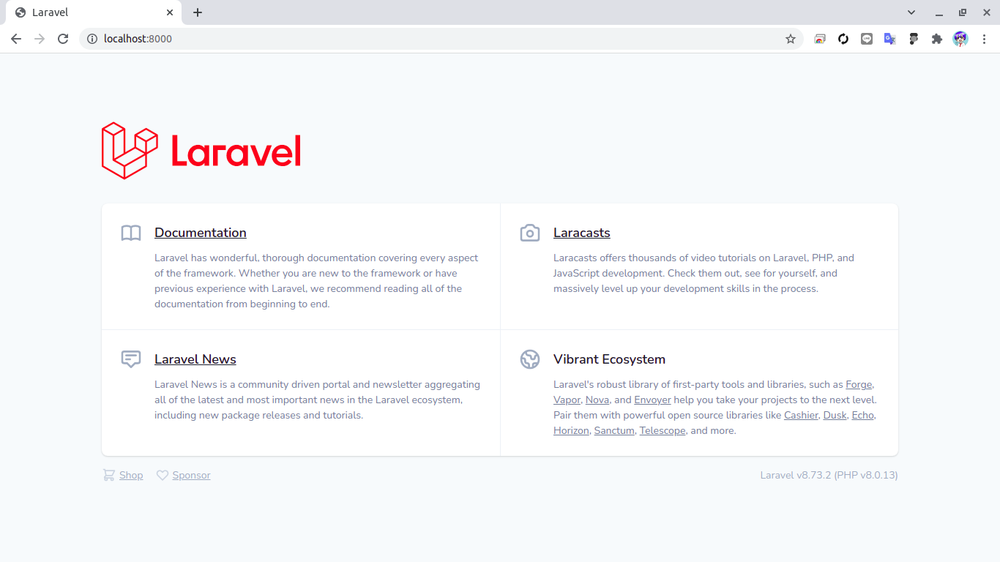
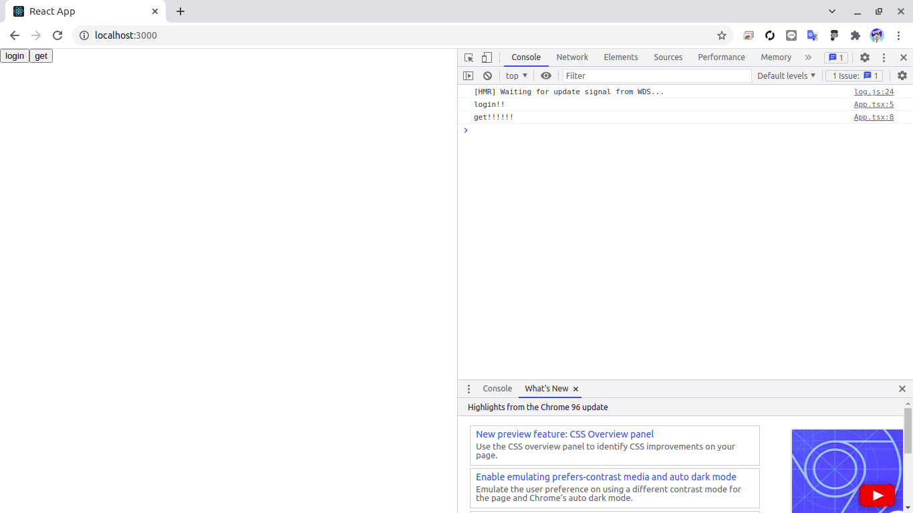

# docker禁止laravel
> mysqlは許す。

# laravel
## phpインストール
```shell
sudo add-apt-repository ppa:ondrej/php
sudo apt update
sudo apt install php8.0 php8.0-dom php8.0-mbstring php8.0-mysql
```

phpバージョン変更
```shell
sudo update-alternatives --config php
```

## composerインストール
```shell
sudo apt-get remove composer;
php -r "copy('https://getcomposer.org/installer', 'composer-setup.php');";
sudo php composer-setup.php --install-dir=/usr/bin --filename=composer;
composer self-update;
```

## laravelプロジェクト作成
```shell
composer create-project --prefer-dist laravel/laravel laravel "8.*"
```

## mysql立ち上げる
```shell
docker-compose up -d
```

## env書き換え
.env.example
```
DB_CONNECTION=mysql
DB_HOST=127.0.0.1
DB_PORT=3306
DB_DATABASE=database
DB_USERNAME=user
DB_PASSWORD=password
```

コピー
```shell
cp .env.example .env
```

## mysqlと繋がったか確認
```shell
php artisan migrate
```

## サーバー仮起動
```shell
php artisan serve
```

## 鍵作れと怒られた。。
```shell
php artisan key:generate
```

## もう一度確認！

起動ヨシ！

# react
## reactインストール
```shell
npx create-react-app app --template typescript
```

## login処理用の画面作成
src/App.tsx
```ts
import React from 'react';

function App() {
  const login = () => {
    console.log('login!!');
  }
  const get = () => {
    console.log('get!!!!!!');
  }
  return (
    <div className="App">
      <button onClick={() => login()}>login</button>
      <button onClick={() => get()}>get</button>
    </div>
  );
}

export default App;
```

## 起動してみる
```
npm run start
```


# sanctum
> 公式通りに進めていく

## sanctumインストール
```shell
composer require laravel/sanctum
php artisan vendor:publish --provider="Laravel\Sanctum\SanctumServiceProvider"
php artisan migrate
```

app/Http/Kernel.php
```php
'api' => [
    \Laravel\Sanctum\Http\Middleware\EnsureFrontendRequestsAreStateful::class,
    'throttle:api',
    \Illuminate\Routing\Middleware\SubstituteBindings::class,
],
```

## SPA認証

### CORS設定
> アプリケーションのCORS設定が、値がTrueのAccess-Control-Allow-Credentialsヘッダを返しているか確認する必要があります。これは、アプリケーションのconfig/cors.php設定ファイル内のsupports_credentialsオプションをtrueに設定することで実現できます。

config/cors.php
```php
'supports_credentials' => true
```

### withCredentials
> さらに、アプリケーションのグローバルなaxiosインスタンスでwithCredentialsオプションを有効にする必要があります。通常、これはresources/js/bootstrap.jsファイルで実行する必要があります。フロントエンドからHTTPリクエストを行うためにAxiosを使用していない場合は、独自のHTTPクライアントで同等の構成を実行する必要があります。

```shell
npm install axios --save
```

### セッションクッキードメイン設定
> 最後に、アプリケーションのセッションクッキードメイン設定で、ルートドメインのサブドメインを確実にサポートしてください。これを実現するには、アプリケーションのconfig/session.php設定ファイル内でドメインの先頭に.を付けます。

.env.example
```
SESSION_DOMAIN=localhost
```

コピー
```shell
cp .env.example .env
```

# 認証
## CSRF保護
```ts
axios.get('/sanctum/csrf-cookie').then(response => {
    // ログイン…
});
```

## 適当にuser生やす
```shell
php artisan make:seeder UserSeeder
```

database/seeders/UserSeeder.php
```php
use Illuminate\Support\Facades\DB;
use App\Models\User;
use Illuminate\Support\Facades\Hash;

User::factory()->create([
    'name' => 'test1',
    'email' => 'test1@test.jp',
    'password' => bcrypt('testtest')
]);
DB::table('users')->insert([
    'name' => 'test2',
    'email' => 'test2@test.jp',
    'password' => Hash::make('password')
]);
User::factory()->count(3)->create();
```

database/seeders/DatabaseSeeder.php
```php
$this->call(UserSeeder::class);
```

```shell
php artisan migrate:fresh --seed
```

## login処理適当に書く
routes/api.php
```php
use App\Http\Controllers\UserController;

// Route::middleware('auth:sanctum')->get('/user', function (Request $request) {
//     return $request->user();
// });

Route::post('/login', [UserController::class, 'login']);
Route::middleware('auth:sanctum')->get('/user', [UserController::class, 'index']);

Route::get('/', function () {
    return 'Hello World';
});
```

```shell
php artisan make:controller UserController --api
```

app/Http/Controllers/UserController.php
```php
use Illuminate\Support\Facades\Auth;

public function index()
{
    //
    return Auth::user();
}

public function login(Request $request)
{
    if (Auth::attempt($request->all())) {
        return Auth::user();
    }
}
```

## getしてみる
axios.get('http://localhost:8000/api');
> Access to XMLHttpRequest at 'http://localhost:8000/api' from origin 'http://localhost:3000' has been blocked by CORS policy: Response to preflight request doesn't pass access control check: No 'Access-Control-Allow-Origin' header is present on the requested resource.

ひぇ。。。

## ってことで、Cors対策
```shell
php artisan make:middleware Cors
```

app\Http\Middleware/Cors.php
```php
return $next($request)
->header('Access-Control-Allow-Origin', '*')
->header('Access-Control-Allow-Methods', '*')
->header('Access-Control-Allow-Headers', '*');
```
> 全許容なので本番運用時は注意

app/Http/Kernel.php
```php
'api' => [
    \App\Http\Middleware\Cors::class,
```

## もう一度get!!
```json
{data: 'Hello World', status: 200, statusText: 'OK', headers: {…}, config: {…}, …}config: {transitional: {…}, transformRequest: Array(1), transformResponse: Array(1), timeout: 0, adapter: ƒ, …}data: "Hello World"headers: {cache-control: 'no-cache, private', content-type: 'text/html; charset=UTF-8'}request: XMLHttpRequest {onreadystatechange: null, readyState: 4, timeout: 0, withCredentials: false, upload: XMLHttpRequestUpload, …}status: 200statusText: "OK"[[Prototype]]: Object
```

やったー!!

## フロント側のlogin処理を書く
```ts
import React from 'react';
import Axios from 'axios';

function App() {
  const test = async () => {
    Axios.get('http://localhost:8000/api')
      .then(res => {
        console.log(res);
      });
  }

  const login = async () => {
    const formData = {
      email: 'test1@test.jp',
      password: 'testtest',
    }
    Axios.get('http://localhost:8000/sanctum/csrf-cookie').then(response => {
      // ログイン…
      Axios
        .post('http://localhost:8000/api/login', formData)
        .then(res => (console.log(res.data)));
    });
  }

  const get = () => {
    console.log('get!!!!!!');
    Axios.get('http://localhost:8000/api/user').then(response => {
      console.log(response);
    });
  }
  
  return (
    <div className="App">
      <button onClick={() => test()}>test</button>
      <button onClick={() => login()}>login</button>
      <button onClick={() => get()}>get</button>
    </div>
  );
}

export default App;
```

## login!!
```json
"message": "CSRF token mismatch.",
```
> うっっうううう。。。。

## env変更
```
SANCTUM_STATEFUL_DOMAINS=http://localhost:3000/
```

## もう一度ログイン！！！！
```json
{"id":1,"name":"test1","email":"test1@test.jp","email_verified_at":"2021-11-24T05:33:42.000000Z","created_at":"2021-11-24T05:33:42.000000Z","updated_at":"2021-11-24T05:33:42.000000Z"}
```
